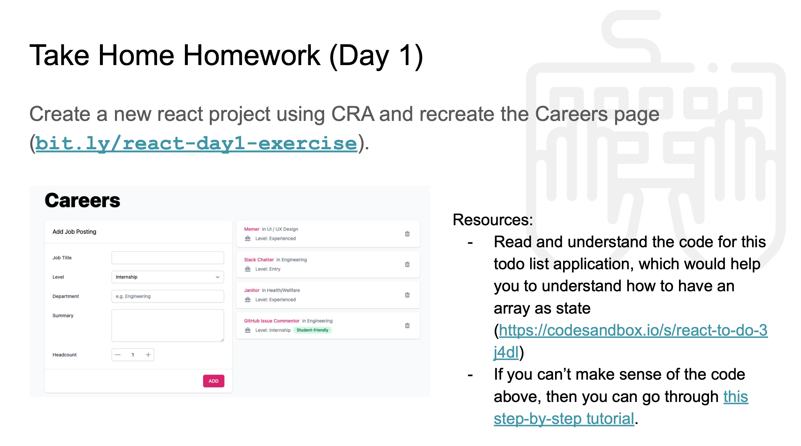

# FrontendDev Homework (Day 1)

# Completed

## CareerForm component (80% done)
reference: https://www.digitalocean.com/community/tutorials/how-to-build-forms-in-react

see src/career.jsx

### Help needed.
I have problem in binding the formData.summary (text-area). Somehow the handleChange function is not working on text-area changes.

## removeJob function (done)

## updateJob function (partially done)
Managed to pass the index of the CareerItems component into the updateJob function. 
